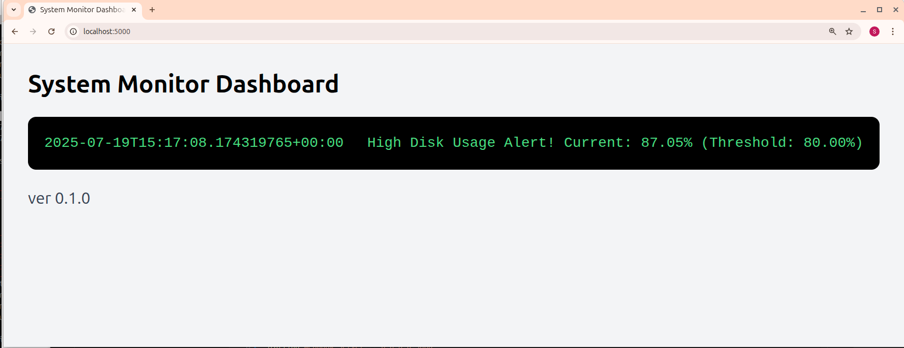

# System Monitor

A simple system monitoring tool written in Rust.

[Online documentation](https://scatarinos.github.io/rust-system-monitor/system_monitor/)

## Features

- Monitor CPU, memory, and disk usage.
- Send notifications via:
  - Console
  - Webhook (e.g., Slack, Discord)
  - Email (optional)

## Usage (system_monitor)
```bash
# cargo run --quiet --bin system_monitor -- -h # development
# make run
system_monitor -h # release
Usage: system_monitor [OPTIONS]

Options:
  -c, --config <CONFIG>  Path to config.toml [default: ./config.toml]
      --set <KEY=VALUE>  Override config values (format: key=value)
  -h, --help             Print help
  -V, --version          Print version
```

```bash
# overriding config 
cargo run --quiet --bin system_monitor -- -c src/config.toml --set notifications.type=webhook --set monitor.cpu_threshold_percent=20
```

## Usage (webhook_server)
```bash
# make webhook # development
PORT=5000 webhook_server

Starting Webhook Server... 0.0.0.0:5000
```

## dashboard



## config.toml
```toml
[monitor]
check_interval_seconds = 5 # Check every 5 seconds
cpu_threshold_percent = 50.0
memory_threshold_percent = 50.0
disk_threshold_percent = 80.0

[notifications]
type = "webhook" # console | webhook | email
webhook_url = "http://localhost:5000/webhook"

# Uncomment and fill these for email notifications
# email_config = {
#     recipient = "admin@example.com",
#     smtp_server = "smtp.mailtrap.io", # Use a real SMTP server for production
#     smtp_port = 2525,
#     username = "your_smtp_username", # Use environment variables or secure config for production
#     password = "your_smtp_password", # Use environment variables or secure config for production
#     from_address = "monitor@yourdomain.com"
# }
```

## License

This project is licensed under the MIT License.